# System Architecture Documentation

## Overview

buildyoursmartcart.com is a full-stack web application built with a modern microservices-inspired architecture. The system combines AI-powered recipe generation with e-commerce integration, providing users with personalized meal planning and grocery shopping experiences.

## High-Level Architecture

```mermaid
graph TB
    subgraph "Client Layer"
        A[React Frontend]
        B[Mobile Browser]
        C[Desktop Browser]
    end
    
    subgraph "Load Balancer / CDN"
        D[Google Cloud Load Balancer]
    end
    
    subgraph "Application Layer"
        E[FastAPI Backend]
        F[Static File Server]
    end
    
    subgraph "Service Layer"
        G[Authentication Service]
        H[Recipe Service] 
        I[Payment Service]
        J[Email Service]
        K[Database Service]
    end
    
    subgraph "Data Layer"
        L[MongoDB Atlas]
        M[File Storage]
    end
    
    subgraph "External APIs"
        N[OpenAI API]
        O[Stripe API]
        P[Walmart API]
        Q[Mailjet API]
    end
    
    A --> D
    B --> D
    C --> D
    D --> E
    D --> F
    E --> G
    E --> H
    E --> I
    E --> J
    G --> K
    H --> K
    I --> K
    J --> K
    K --> L
    F --> M
    H --> N
    I --> O
    H --> P
    J --> Q
```



## Component Architecture

### 1. Frontend (React Application)

**Location**: `/frontend/`

**Key Components**:
- **App.js**: Main application router and state management
- **Authentication Components**: Login, registration, verification
- **Recipe Components**: Generation, history, detail views
- **Subscription Components**: Payment, trial management
- **Weekly Planner**: Meal planning interface

**Patterns Used**:
- Component-based architecture
- React Hooks for state management
- Responsive design with Tailwind CSS
- API service layer for backend communication

**Data Flow**:
```
User Interaction → Component State → API Service → Backend API
                ↓
Component Re-render ← State Update ← API Response
```

### 2. Backend (FastAPI Application)

**Location**: `/src/backend/`

**Structure**:
```
backend/
├── main.py           # FastAPI app initialization
├── api/              # Route handlers
│   ├── auth.py       # Authentication endpoints
│   └── recipes.py    # Recipe endpoints
├── models/           # Pydantic data models
│   ├── user.py       # User models
│   ├── recipe.py     # Recipe models
│   └── payment.py    # Payment models
├── services/         # Business logic layer
│   ├── auth.py       # Authentication service
│   ├── recipe.py     # Recipe generation
│   ├── database.py   # Database abstraction
│   ├── email.py      # Email service
│   └── stripe.py     # Payment processing
└── utils/            # Utility functions
```

**Design Patterns**:
- **Service Layer Pattern**: Business logic separated from API routes
- **Repository Pattern**: Database access abstracted through services
- **Dependency Injection**: Services injected into API routes
- **Factory Pattern**: Database connections and external API clients

### 3. Database Design

**Technology**: MongoDB with Motor (async driver)

**Collections**:

```javascript
// Users Collection
{
  id: "uuid",
  email: "user@example.com", 
  password: "bcrypt_hash",
  is_verified: boolean,
  subscription: {
    status: "trialing|active|expired|cancelled",
    trial_starts_at: "ISO_date",
    trial_ends_at: "ISO_date",
    customer_id: "stripe_id",
    subscription_id: "stripe_id"
  },
  usage_limits: {
    weekly_recipes: {used: 0, limit: 2},
    individual_recipes: {used: 0, limit: 10}, 
    starbucks_drinks: {used: 0, limit: 10},
    last_reset: "ISO_date"
  },
  created_at: "ISO_date",
  updated_at: "ISO_date"
}

// Recipes Collection
{
  id: "uuid",
  user_id: "user_uuid",
  name: "Recipe Name",
  description: "Description",
  ingredients: ["ingredient1", "ingredient2"],
  instructions: ["step1", "step2"],
  prep_time: "15 minutes",
  cook_time: "30 minutes", 
  servings: 4,
  difficulty: "easy|medium|hard",
  cuisine_type: "italian|mexican|asian|etc",
  dietary_preferences: ["vegetarian", "gluten-free"],
  calories: 500,
  category: "regular|starbucks",
  created_at: "ISO_date"
}

// Weekly Recipes Collection
{
  id: "uuid",
  user_id: "user_uuid",
  week_id: "2025-W32",
  recipes: [Recipe],
  created_at: "ISO_date"
}

// Payment Transactions Collection
{
  id: "uuid",
  user_id: "user_uuid",
  session_id: "stripe_session_id",
  amount: 9.99,
  currency: "usd",
  status: "pending|completed|failed",
  created_at: "ISO_date"
}
```

**Indexing Strategy**:
- User email (unique index)
- Recipe user_id + created_at (compound index)
- Payment transactions session_id (unique index)
- Weekly recipes user_id + week_id (compound index)

### 4. Service Layer Architecture

#### Authentication Service

**Responsibilities**:
- User registration and login
- Password hashing (bcrypt)
- Email verification
- Session management
- Usage limit tracking

**Security Features**:
- Bcrypt password hashing
- Email verification with expiring codes
- Input validation with Pydantic

#### Recipe Service

**Responsibilities**:
- AI recipe generation (OpenAI integration)
- Fallback recipe templates
- Recipe storage and retrieval
- Weekly meal plan generation
- Starbucks recipe management

**AI Integration**:
```python
# Recipe generation flow
def generate_recipe(request):
    if openai_enabled:
        return generate_ai_recipe(request)
    else:
        return generate_fallback_recipe(request)
```

#### Payment Service

**Responsibilities**:
- Stripe integration
- Subscription management
- Usage limit enforcement
- Webhook handling

**Stripe Integration**:
- Checkout session creation
- Subscription lifecycle management
- Webhook event processing
- Customer management

### 5. External API Integration

#### OpenAI Integration

**Purpose**: AI-powered recipe generation
**Implementation**: OpenAI Python client
**Fallback**: Template-based recipes when API unavailable

```python
# AI Recipe Generation
prompt = f"""
Create a {cuisine_type} recipe with:
- Difficulty: {difficulty}
- Servings: {servings}
- Dietary preferences: {dietary_preferences}
Return JSON with name, ingredients, instructions, etc.
"""
```

#### Stripe Integration

**Purpose**: Payment processing and subscription management
**Implementation**: Native Stripe Python library
**Features**:
- Checkout session creation
- Subscription lifecycle management
- Webhook processing
- Customer portal integration

#### Walmart API Integration

**Purpose**: Product search and cart generation
**Implementation**: Custom HTTP client with cryptographic signatures
**Features**:
- Product search by ingredient
- Real-time pricing
- Cart URL generation
- Affiliate link tracking

## Security Architecture

### 1. Authentication & Authorization

- **Password Security**: Bcrypt hashing with salt
- **Email Verification**: Time-limited verification codes
- **Session Management**: Stateless (can be extended with JWT)
- **Input Validation**: Pydantic models for all inputs

### 2. API Security

- **CORS Configuration**: Restricted origins in production
- **Rate Limiting**: API endpoint rate limiting
- **Input Sanitization**: Automatic with Pydantic
- **Error Handling**: Secure error responses

### 3. Data Security

- **Environment Variables**: All secrets in environment variables
- **Database Security**: Parameterized queries, no SQL injection
- **Encryption**: HTTPS in production
- **PII Protection**: Minimal personal data collection

### 4. Infrastructure Security

- **Container Security**: Docker with minimal base image
- **Cloud Security**: Google Cloud IAM and VPC
- **Secrets Management**: Google Secret Manager
- **Monitoring**: Cloud logging and monitoring

## Scalability Considerations

### 1. Database Scaling

**Current**: Single MongoDB instance
**Future Scaling Options**:
- MongoDB Atlas cluster scaling
- Read replicas for read-heavy operations
- Sharding by user_id for large datasets

### 2. Application Scaling

**Current**: Single container instance
**Future Scaling Options**:
- Horizontal scaling with load balancer
- Microservices split by domain
- Caching layer with Redis
- CDN for static assets

### 3. External API Scaling

**Rate Limiting**: Implement backoff strategies
**Caching**: Cache AI responses for similar requests
**Fallbacks**: Graceful degradation when APIs unavailable

## Performance Optimization

### 1. Database Performance

- **Indexes**: Strategic indexing on query patterns
- **Connection Pooling**: MongoDB connection pooling
- **Query Optimization**: Efficient aggregation pipelines

### 2. API Performance

- **Async Processing**: FastAPI with async/await
- **Response Caching**: Cache frequently requested data
- **Lazy Loading**: Load data on demand

### 3. Frontend Performance

- **Code Splitting**: React lazy loading
- **Image Optimization**: Optimized image assets
- **Bundle Optimization**: Webpack optimization

## Monitoring & Observability

### 1. Application Monitoring

- **Health Checks**: `/health` endpoint with dependency checks
- **Logging**: Structured logging with correlation IDs
- **Metrics**: Response times, error rates, usage metrics

### 2. Infrastructure Monitoring

- **Container Monitoring**: Resource usage and scaling
- **Database Monitoring**: Query performance and connections
- **External API Monitoring**: Response times and error rates

### 3. Business Metrics

- **User Engagement**: Recipe generation rates
- **Conversion Tracking**: Trial to paid conversion
- **Usage Analytics**: Feature usage patterns

## Deployment Architecture

### Development Environment

```
localhost:3000 (Frontend) → localhost:8001 (Backend) → localhost:27017 (MongoDB)
```

### Production Environment

```
buildyoursmartcart.com (Frontend) → Google Cloud Run (Backend) → MongoDB Atlas
                                                    ↓
                               External APIs (OpenAI, Stripe, Walmart, Mailjet)
```

**Deployment Pipeline**:
1. Code commit to repository
2. Container build and test
3. Security scanning
4. Deploy to Google Cloud Run
5. Health check verification
6. Traffic routing

## Future Architecture Considerations

### 1. Microservices Migration

**Current**: Monolithic FastAPI application
**Future**: Split into focused microservices:
- Authentication Service
- Recipe Service
- Payment Service
- Notification Service

### 2. Event-Driven Architecture

**Implementation**: Message queues for async processing
**Benefits**: Better scalability and resilience
**Technology Options**: Google Pub/Sub, RabbitMQ

### 3. AI/ML Pipeline

**Current**: Direct OpenAI API calls
**Future**: Custom ML pipeline with:
- Recipe recommendation engine
- User preference learning
- Inventory optimization

### 4. Mobile Application

**Architecture**: React Native or Flutter
**API**: Same backend API with mobile-optimized endpoints
**Features**: Offline recipe access, grocery list sync

## Conclusion

The current architecture provides a solid foundation for the buildyoursmartcart.com application with clear separation of concerns, security best practices, and scalability options. The modular design allows for future enhancements and scaling as the business grows.

Key strengths:
- Clean service layer architecture
- Comprehensive security implementation
- External API integration with fallbacks
- Scalable database design
- Modern deployment practices

This architecture supports current business requirements while providing a path for future growth and feature expansion.