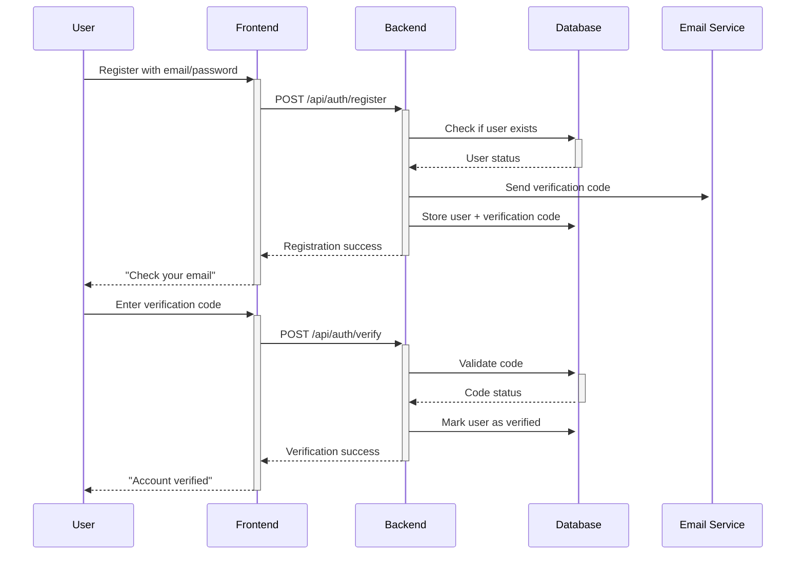
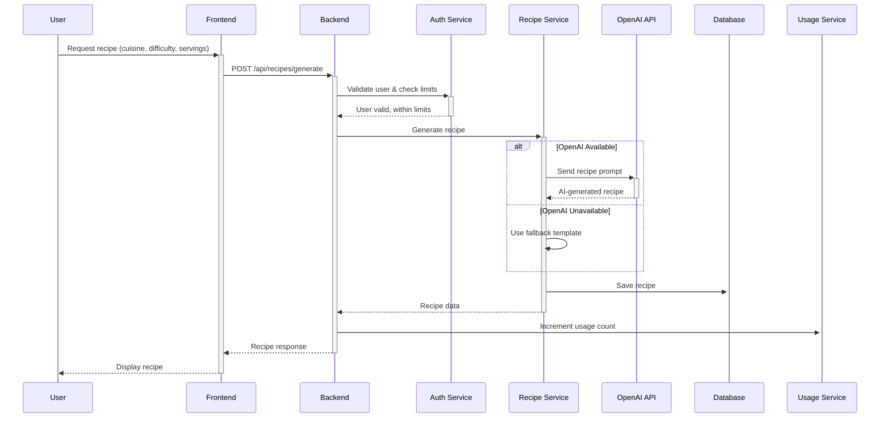
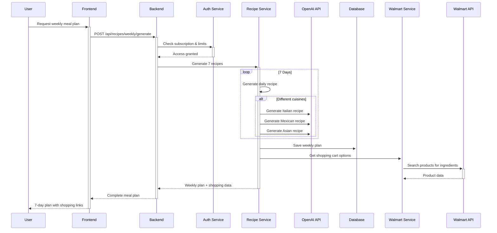
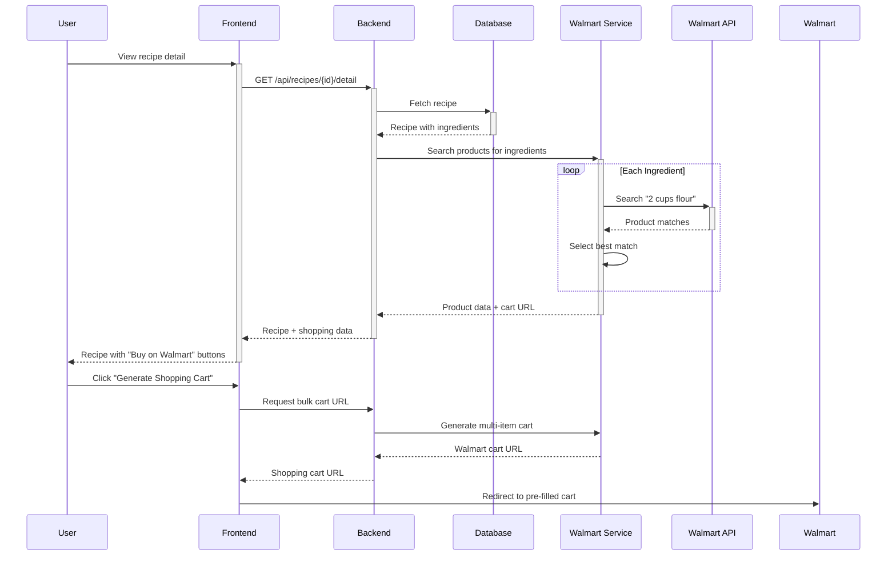
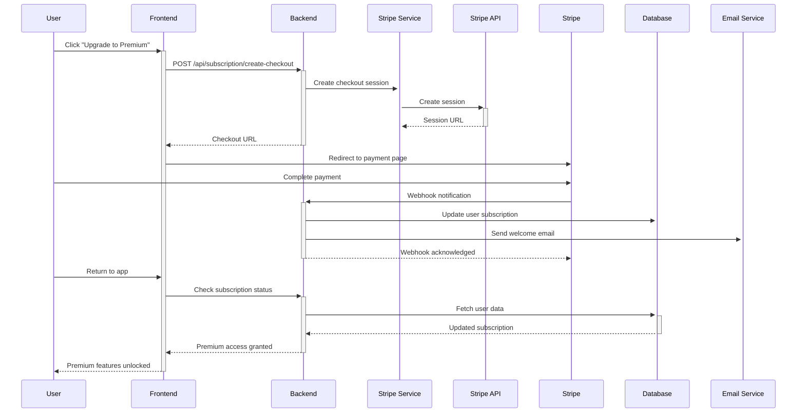

# How the buildyoursmartcart.com Project Works

## Overview

buildyoursmartcart.com is an AI-powered recipe and grocery delivery application that combines intelligent meal planning with automated shopping cart generation. The system provides users with personalized recipes, weekly meal plans, and direct integration with Walmart for grocery shopping.

## System Architecture

### High-Level Flow

```
User Request → React Frontend → FastAPI Backend → External APIs → Database
     ↓              ↓               ↓              ↓           ↓
User Response ← JSON Response ← Service Layer ← API Response ← Data Storage
```

### Core Components

#### 1. **Frontend (React Application)**
- **Location**: `/frontend/`
- **Technology**: React 18, Tailwind CSS, Axios
- **Responsibility**: User interface, form handling, API communication

**Key Components:**
- **Authentication**: Login, registration, email verification
- **Recipe Generation**: Individual recipe creation with AI
- **Weekly Planner**: 7-day meal plan generation
- **Recipe History**: View and manage saved recipes
- **Subscription Management**: Payment processing and trial management

#### 2. **Backend (FastAPI Application)**
- **Location**: `/src/backend/`
- **Technology**: FastAPI, Python 3.9+, Motor (MongoDB async driver)
- **Responsibility**: Business logic, API endpoints, external integrations

**Architecture Layers:**

```
API Routes (/src/backend/api/)
     ↓
Service Layer (/src/backend/services/)
     ↓
Data Models (/src/backend/models/)
     ↓
Database (MongoDB)
```

#### 3. **Database (MongoDB)**
- **Technology**: MongoDB with Motor async driver
- **Purpose**: User data, recipes, subscriptions, usage tracking

**Collections:**
- `users`: User accounts, subscription status, usage limits
- `recipes`: Generated recipes with ingredients and instructions
- `weekly_recipes`: Weekly meal plans
- `starbucks_recipes`: Starbucks secret menu items
- `payment_transactions`: Stripe payment records

## How It Works: Step-by-Step

### 1. User Registration & Authentication



**What happens:**
1. User provides email and password
2. Backend hashes password with bcrypt
3. System generates 6-digit verification code
4. Email service sends verification email
5. User enters code to complete registration
6. Account is activated with 7-day free trial

### 2. Recipe Generation



**What happens:**
1. User selects cuisine type, difficulty, servings, dietary preferences
2. System checks if user is within usage limits
3. If OpenAI is available, generates AI recipe; otherwise uses templates
4. Recipe is saved to database with user association
5. Usage limits are updated
6. Recipe is displayed with ingredients and instructions

### 3. Weekly Meal Planning



**What happens:**
1. System generates 7 different recipes for the week
2. Each recipe targets different cuisine types for variety
3. All recipes are saved as a weekly plan
4. System searches Walmart API for all ingredients
5. Shopping cart URLs are generated for each recipe
6. User gets complete meal plan with one-click shopping

### 4. Walmart Shopping Integration



**What happens:**
1. For each ingredient, system searches Walmart's product database
2. AI matches ingredients to actual products (e.g., "2 cups flour" → "Gold Medal All-Purpose Flour, 5 lb")
3. System generates individual product links and bulk cart URLs
4. User can buy individual items or create complete shopping cart
5. Affiliate tracking enables commission on purchases

### 5. Subscription Management



**What happens:**
1. User clicks upgrade button
2. System creates Stripe checkout session
3. User completes payment on Stripe's secure page
4. Stripe sends webhook to confirm payment
5. System updates user's subscription status
6. Usage limits are increased to premium levels
7. User gains access to premium features

## Data Flow Architecture

### Request Processing

```
HTTP Request → CORS Middleware → Route Handler → Service Layer → Database
     ↓              ↓               ↓              ↓             ↓ 
Validation → Authentication → Business Logic → Data Processing → Storage
```

### Response Generation

```
Database Result → Service Processing → Model Serialization → JSON Response
        ↓                ↓                     ↓                ↓
   Raw Data → Business Logic → Pydantic Models → HTTP Response
```

## External API Integrations

### 1. OpenAI API (Recipe Generation)
- **Purpose**: AI-powered recipe creation
- **Input**: Cuisine type, difficulty, dietary preferences, servings
- **Output**: Structured recipe with name, ingredients, instructions
- **Fallback**: Template-based recipes when API unavailable

### 2. Stripe API (Payment Processing)
- **Purpose**: Subscription management and payments
- **Features**: Checkout sessions, webhooks, customer management
- **Security**: Native Stripe library with environment variables

### 3. Walmart API (Product Search)
- **Purpose**: Grocery product search and cart generation
- **Features**: Product search, pricing, cart URL generation
- **Authentication**: Cryptographic signatures with private key

### 4. Mailjet API (Email Service)
- **Purpose**: Transactional emails
- **Features**: Verification codes, welcome emails, notifications
- **Fallback**: Logging when in development mode

## Security Architecture

### Authentication Flow
1. **Password Hashing**: Bcrypt with salt
2. **Email Verification**: Time-limited 6-digit codes
3. **Session Management**: Stateless (can extend with JWT)
4. **Input Validation**: Pydantic models for all inputs

### Data Protection
1. **Environment Variables**: All secrets externalized
2. **Database Security**: Parameterized queries, no SQL injection
3. **CORS**: Restricted origins in production
4. **Rate Limiting**: API endpoint protection

## Usage Limits & Business Logic

### Free Trial (7 days)
- Weekly meal plans: 2 per month
- Individual recipes: 10 per month  
- Starbucks drinks: 10 per month

### Premium Subscription ($9.99/month)
- Weekly meal plans: 8 per month
- Individual recipes: 30 per month
- Starbucks drinks: 30 per month

### Limit Enforcement
```python
# Check if user can generate recipe
def check_usage_limits(user, feature_type):
    limits = user['usage_limits'][feature_type]
    if limits['used'] >= limits['limit']:
        raise HTTPException(402, "Usage limit exceeded")
    
    # Increment usage
    limits['used'] += 1
    update_user_limits(user['id'], limits)
```

## Error Handling & Resilience

### API Resilience
- **Graceful Degradation**: Fallback recipes when OpenAI unavailable
- **Error Recovery**: Retry logic for transient failures
- **Circuit Breakers**: Prevent cascade failures

### User Experience
- **Clear Error Messages**: User-friendly error descriptions
- **Fallback Content**: Template recipes always available
- **Retry Mechanisms**: Automatic retry for failed operations

## Performance Optimization

### Database Performance
- **Indexing**: Strategic indexes on query patterns
- **Connection Pooling**: MongoDB connection optimization
- **Async Operations**: Non-blocking database operations

### API Performance  
- **Async Processing**: FastAPI with async/await
- **Response Caching**: Cache frequently requested data
- **Lazy Loading**: Load data on demand

## Monitoring & Health Checks

### Health Endpoint (`/api/health`)
```json
{
  "status": "healthy",
  "service": "buildyoursmartcart-api",
  "version": "3.0.0", 
  "database": "healthy",
  "external_apis": {
    "openai": true,
    "mailjet": true,
    "walmart": true,
    "stripe": true
  },
  "timestamp": "2025-08-14T16:21:10.788648"
}
```

### Logging Strategy
- **Structured Logging**: JSON format with correlation IDs
- **Error Tracking**: Comprehensive error logging
- **Performance Metrics**: Response times and usage statistics

## Deployment Architecture

### Development Environment
```
React (localhost:3000) → FastAPI (localhost:8001) → MongoDB (localhost:27017)
```

### Production Environment  
```
buildyoursmartcart.com → Google Cloud Run → MongoDB Atlas
                            ↓
                    External APIs (OpenAI, Stripe, Walmart, Mailjet)
```

## Summary

The buildyoursmartcart.com application works by:

1. **Accepting user requests** through a React frontend
2. **Processing business logic** in a FastAPI backend
3. **Integrating with AI services** for recipe generation
4. **Connecting to e-commerce APIs** for shopping integration
5. **Managing subscriptions** through Stripe
6. **Storing data** in MongoDB
7. **Delivering responses** back to users

The system is designed for scalability, security, and maintainability, with clear separation of concerns, comprehensive error handling, and modern development practices.