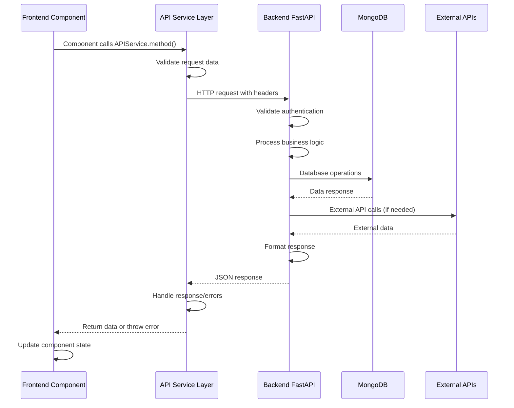

# Frontend-Backend Integration Architecture

## Overview
This document provides detailed technical specifications for frontend-backend integration patterns, communication protocols, and data flow management in the AI Recipe + Grocery Delivery App.

## Communication Protocol

### API Request/Response Pattern


### Base API Configuration
```javascript
// frontend/src/services/apiService.js
class APIService {
  constructor() {
    this.baseURL = process.env.REACT_APP_BACKEND_URL || 'http://localhost:8001';
    this.timeout = 30000; // 30 second timeout
  }

  async request(endpoint, options = {}) {
    const url = `${this.baseURL}/api${endpoint}`;
    const config = {
      timeout: this.timeout,
      headers: {
        'Content-Type': 'application/json',
        ...this.getAuthHeaders(),
        ...options.headers
      },
      ...options
    };

    try {
      const controller = new AbortController();
      const timeoutId = setTimeout(() => controller.abort(), this.timeout);
      
      const response = await fetch(url, {
        ...config,
        signal: controller.signal
      });
      
      clearTimeout(timeoutId);
      
      if (!response.ok) {
        const errorData = await this.parseErrorResponse(response);
        throw new APIError(response.status, errorData.message, errorData.error_code);
      }
      
      return await response.json();
    } catch (error) {
      if (error.name === 'AbortError') {
        throw new APIError(408, 'Request timeout', 'TIMEOUT');
      }
      
      if (error instanceof APIError) {
        throw error;
      }
      
      throw new APIError(500, 'Network error', 'NETWORK_ERROR');
    }
  }

  getAuthHeaders() {
    const user = JSON.parse(localStorage.getItem('ai_chef_user') || '{}');
    return user.token ? { 'Authorization': `Bearer ${user.token}` } : {};
  }

  async parseErrorResponse(response) {
    try {
      return await response.json();
    } catch {
      return { message: response.statusText, error_code: 'UNKNOWN_ERROR' };
    }
  }
}

// Custom error class for API errors
class APIError extends Error {
  constructor(status, message, errorCode) {
    super(message);
    this.name = 'APIError';
    this.status = status;
    this.errorCode = errorCode;
  }
}

const apiService = new APIService();
export { apiService, APIError };
```

### Service-Specific API Modules
```javascript
// frontend/src/services/recipeService.js
import { apiService } from './apiService';

export const recipeService = {
  // Recipe generation
  async generateRecipe(params) {
    return await apiService.request('/recipes/generate', {
      method: 'POST',
      body: JSON.stringify(params)
    });
  },

  // Recipe history
  async getRecipeHistory(userId, page = 1, perPage = 20) {
    return await apiService.request(
      `/recipes/history/${userId}?page=${page}&per_page=${perPage}`
    );
  },

  // Recipe detail with source-aware endpoint selection
  async getRecipeDetail(recipeId, source = 'history') {
    const endpoint = source === 'weekly' 
      ? `/weekly-recipes/recipe/${recipeId}`
      : `/recipes/${recipeId}/detail`;
    
    return await apiService.request(endpoint);
  },

  // Recipe deletion
  async deleteRecipe(recipeId) {
    return await apiService.request(`/recipes/${recipeId}`, {
      method: 'DELETE'
    });
  },

  // Weekly recipe generation
  async generateWeeklyRecipes(params) {
    return await apiService.request('/weekly-recipes/generate', {
      method: 'POST',
      body: JSON.stringify(params)
    });
  },

  // Current weekly recipes
  async getCurrentWeeklyRecipes(userId) {
    return await apiService.request(`/weekly-recipes/current/${userId}`);
  }
};
```

## Data Flow Patterns

### Component-to-Backend Data Flow
```javascript
// Pattern 1: Standard CRUD Operations
const RecipeHistoryScreen = ({ user, showNotification, onViewRecipe }) => {
  const [recipes, setRecipes] = useState([]);
  const [isLoading, setIsLoading] = useState(true);
  const [error, setError] = useState(null);

  // Load recipes with comprehensive error handling
  useEffect(() => {
    const loadRecipes = async () => {
      try {
        setIsLoading(true);
        setError(null);
        
        const data = await recipeService.getRecipeHistory(user.id);
        setRecipes(data.recipes);
        
      } catch (error) {
        console.error('Failed to load recipes:', error);
        setError(error.message);
        showNotification('Failed to load recipes', 'error');
      } finally {
        setIsLoading(false);
      }
    };

    if (user?.id) {
      loadRecipes();
    }
  }, [user.id, showNotification]);

  // Delete recipe with optimistic updates
  const handleDeleteRecipe = async (recipeId) => {
    if (!window.confirm('Delete this recipe?')) return;

    // Optimistic update
    const originalRecipes = [...recipes];
    setRecipes(prev => prev.filter(r => r.id !== recipeId));

    try {
      await recipeService.deleteRecipe(recipeId);
      showNotification('Recipe deleted', 'success');
    } catch (error) {
      // Revert optimistic update on error
      setRecipes(originalRecipes);
      showNotification('Failed to delete recipe', 'error');
    }
  };

  // Navigation with proper context
  const handleViewRecipe = (recipe) => {
    const source = recipe.type === 'starbucks' ? 'starbucks' : 'history';
    onViewRecipe(recipe.id, source);
  };

  return (
    <div>
      {isLoading && <LoadingSpinner />}
      {error && <ErrorMessage error={error} onRetry={() => loadRecipes()} />}
      {recipes.map(recipe => (
        <RecipeCard
          key={recipe.id}
          recipe={recipe}
          onView={() => handleViewRecipe(recipe)}
          onDelete={() => handleDeleteRecipe(recipe.id)}
        />
      ))}
    </div>
  );
};
```

### Backend Request Processing Pattern
```python
# backend/server.py - Request processing pattern
from fastapi import APIRouter, HTTPException, Depends, Request
from pydantic import BaseModel, validator
import logging
from typing import List, Optional

logger = logging.getLogger(__name__)
api_router = APIRouter(prefix="/api")

class RecipeHistoryResponse(BaseModel):
    recipes: List[Dict]
    total_count: int
    page: int
    per_page: int
    has_more: bool

@api_router.get("/recipes/history/{user_id}", response_model=RecipeHistoryResponse)
async def get_recipe_history(
    user_id: str,
    page: int = Query(1, ge=1),
    per_page: int = Query(20, ge=1, le=100),
    request: Request = None
):
    """
    Get paginated recipe history for a user.
    
    Args:
        user_id: UUID of the user
        page: Page number (1-based)
        per_page: Items per page (1-100)
        
    Returns:
        RecipeHistoryResponse with paginated recipes
        
    Raises:
        HTTPException: For invalid user or database errors
    """
    request_id = getattr(request.state, 'request_id', 'unknown')
    
    try:
        logger.info(
            "Fetching recipe history",
            extra={
                'user_id': user_id,
                'page': page,
                'per_page': per_page,
                'request_id': request_id
            }
        )
        
        # Validate user exists
        user = await users_collection.find_one({"id": user_id})
        if not user:
            logger.warning("User not found", extra={'user_id': user_id})
            raise HTTPException(status_code=404, detail="User not found")
        
        # Calculate pagination
        skip = (page - 1) * per_page
        
        # Fetch recipes from multiple collections
        recipes_data = []
        
        # Regular recipes
        regular_recipes_cursor = recipes_collection.find(
            {"user_id": user_id}
        ).sort("created_at", -1).skip(skip).limit(per_page)
        regular_recipes = await regular_recipes_cursor.to_list(per_page)
        
        # Process and add type information
        for recipe in regular_recipes:
            recipe_dict = mongo_to_dict(recipe)
            recipe_dict['category'] = 'regular'
            recipe_dict['type'] = 'recipe'
            recipes_data.append(recipe_dict)
        
        # Starbucks recipes
        starbucks_cursor = starbucks_recipes_collection.find(
            {"user_id": user_id}
        ).sort("created_at", -1)
        starbucks_recipes = await starbucks_cursor.to_list(None)
        
        for recipe in starbucks_recipes:
            recipe_dict = mongo_to_dict(recipe)
            recipe_dict['category'] = 'starbucks'
            recipe_dict['type'] = 'starbucks'
            recipes_data.append(recipe_dict)
        
        # Sort combined results by created_at
        recipes_data.sort(key=lambda x: x.get('created_at', ''), reverse=True)
        
        # Apply pagination to combined results
        paginated_recipes = recipes_data[skip:skip + per_page]
        
        # Get total count
        total_count = len(recipes_data)
        has_more = (skip + per_page) < total_count
        
        logger.info(
            "Recipe history fetched successfully",
            extra={
                'user_id': user_id,
                'total_recipes': total_count,
                'returned_recipes': len(paginated_recipes),
                'request_id': request_id
            }
        )
        
        return RecipeHistoryResponse(
            recipes=paginated_recipes,
            total_count=total_count,
            page=page,
            per_page=per_page,
            has_more=has_more
        )
        
    except HTTPException:
        raise
    except Exception as e:
        logger.error(
            "Failed to fetch recipe history",
            extra={
                'user_id': user_id,
                'error': str(e),
                'request_id': request_id
            }
        )
        raise HTTPException(
            status_code=500,
            detail="Failed to fetch recipe history"
        )

# Utility function for MongoDB document conversion
def mongo_to_dict(doc):
    """Convert MongoDB document to dictionary, handling ObjectId."""
    if doc is None:
        return None
    
    result = {}
    for key, value in doc.items():
        if key == '_id':
            continue  # Skip MongoDB ObjectId
        result[key] = value
    
    return result
```

## Error Handling Patterns

### Frontend Error Handling
```javascript
// Centralized error handling service
class ErrorHandlingService {
  static handleAPIError(error, showNotification) {
    if (error instanceof APIError) {
      switch (error.status) {
        case 401:
          this.handleAuthError(error, showNotification);
          break;
        case 402:
          this.handleSubscriptionError(error, showNotification);
          break;
        case 404:
          showNotification('Requested resource not found', 'error');
          break;
        case 408:
          showNotification('Request timed out. Please try again.', 'error');
          break;
        case 429:
          showNotification('Too many requests. Please wait a moment.', 'warning');
          break;
        case 500:
          showNotification('Server error. Please try again later.', 'error');
          break;
        default:
          showNotification(error.message || 'An error occurred', 'error');
      }
    } else {
      showNotification('Network error. Please check your connection.', 'error');
    }
  }

  static handleAuthError(error, showNotification) {
    showNotification('Please log in again', 'warning');
    // Clear stored session
    localStorage.removeItem('ai_chef_user');
    // Redirect to login
    window.location.reload();
  }

  static handleSubscriptionError(error, showNotification) {
    showNotification('Premium subscription required', 'info');
    // Could trigger subscription modal here
  }
}

// Hook for handling async operations with error management
function useAsyncOperation(showNotification) {
  const [isLoading, setIsLoading] = useState(false);
  const [error, setError] = useState(null);

  const execute = useCallback(async (asyncFunction) => {
    try {
      setIsLoading(true);
      setError(null);
      return await asyncFunction();
    } catch (error) {
      setError(error);
      ErrorHandlingService.handleAPIError(error, showNotification);
      throw error;
    } finally {
      setIsLoading(false);
    }
  }, [showNotification]);

  return { execute, isLoading, error };
}

// Usage in components
const RecipeGeneratorScreen = ({ user, showNotification }) => {
  const { execute: generateRecipe, isLoading } = useAsyncOperation(showNotification);

  const handleGenerateRecipe = async (params) => {
    try {
      const recipe = await generateRecipe(() => 
        recipeService.generateRecipe({ ...params, user_id: user.id })
      );
      
      showNotification('Recipe generated successfully!', 'success');
      // Handle success state
      
    } catch (error) {
      // Error already handled by useAsyncOperation
      console.error('Recipe generation failed:', error);
    }
  };

  return (
    <div>
      <RecipeForm onSubmit={handleGenerateRecipe} />
      {isLoading && <LoadingSpinner message="Generating your recipe..." />}
    </div>
  );
};
```

### Backend Error Response Format
```python
# Standardized error response format
from pydantic import BaseModel
from fastapi import HTTPException, Request
from fastapi.responses import JSONResponse
from datetime import datetime
import uuid

class ErrorResponse(BaseModel):
    error_code: str
    message: str
    timestamp: str
    request_id: Optional[str] = None
    details: Optional[Dict] = None

class APIException(Exception):
    def __init__(
        self, 
        status_code: int, 
        error_code: str, 
        message: str, 
        details: Dict = None
    ):
        self.status_code = status_code
        self.error_code = error_code
        self.message = message
        self.details = details or {}

# Global exception handlers
@app.exception_handler(APIException)
async def api_exception_handler(request: Request, exc: APIException):
    return JSONResponse(
        status_code=exc.status_code,
        content=ErrorResponse(
            error_code=exc.error_code,
            message=exc.message,
            timestamp=datetime.utcnow().isoformat(),
            request_id=getattr(request.state, 'request_id', None),
            details=exc.details
        ).dict()
    )

@app.exception_handler(HTTPException)
async def http_exception_handler(request: Request, exc: HTTPException):
    return JSONResponse(
        status_code=exc.status_code,
        content=ErrorResponse(
            error_code=f"HTTP_{exc.status_code}",
            message=exc.detail,
            timestamp=datetime.utcnow().isoformat(),
            request_id=getattr(request.state, 'request_id', None)
        ).dict()
    )

# Middleware for request tracking
@app.middleware("http")
async def request_tracking_middleware(request: Request, call_next):
    request_id = str(uuid.uuid4())
    request.state.request_id = request_id
    
    # Add request ID to response headers
    response = await call_next(request)
    response.headers["X-Request-ID"] = request_id
    
    return response
```

## Data Transformation Patterns

### Frontend Data Processing
```javascript
// Data transformation utilities
class DataTransformer {
  static transformRecipeForDisplay(rawRecipe) {
    return {
      id: rawRecipe.id,
      title: rawRecipe.name || rawRecipe.title,
      description: rawRecipe.description || '',
      prepTime: rawRecipe.prep_time || 'Unknown',
      cookTime: rawRecipe.cook_time || 'Unknown',
      servings: rawRecipe.servings || 1,
      difficulty: rawRecipe.difficulty || 'medium',
      cuisine: rawRecipe.cuisine_type || 'general',
      ingredients: rawRecipe.ingredients || [],
      instructions: rawRecipe.instructions || [],
      createdAt: rawRecipe.created_at ? new Date(rawRecipe.created_at) : new Date(),
      category: rawRecipe.category || 'regular',
      type: rawRecipe.type || 'recipe'
    };
  }

  static transformRecipesListForDisplay(rawRecipes) {
    return rawRecipes.map(recipe => this.transformRecipeForDisplay(recipe));
  }

  static transformRecipeForSubmission(formData, userId) {
    return {
      user_id: userId,
      cuisine_type: formData.cuisine,
      difficulty: formData.difficulty,
      servings: parseInt(formData.servings),
      dietary_preferences: formData.dietaryPreferences || [],
      ingredients: formData.ingredients || [],
      prep_time: formData.prepTime,
      meal_type: formData.mealType
    };
  }

  static transformWalmartCartOptions(rawCartOptions) {
    if (!rawCartOptions?.ingredient_matches) {
      return { ingredientMatches: [], totalProducts: 0, estimatedTotal: 0 };
    }

    return {
      ingredientMatches: rawCartOptions.ingredient_matches.map(match => ({
        ingredient: match.ingredient,
        products: match.products.map(product => ({
          id: product.id,
          name: product.name,
          price: parseFloat(product.price) || 0,
          image: product.image || '',
          brand: product.brand || '',
          rating: product.rating || 0
        })),
        selectedProductId: match.selected_product_id
      })),
      totalProducts: rawCartOptions.total_products || 0,
      estimatedTotal: parseFloat(rawCartOptions.estimated_total) || 0
    };
  }
}
```

### Backend Data Processing
```python
# Data transformation and validation utilities
from typing import Dict, Any, List
from datetime import datetime
import re

class DataProcessor:
    @staticmethod
    def process_recipe_generation_request(request_data: Dict) -> Dict:
        """Process and validate recipe generation request."""
        processed = {
            "user_id": request_data.get("user_id"),
            "cuisine_type": request_data.get("cuisine_type", "").lower(),
            "difficulty": request_data.get("difficulty", "medium").lower(),
            "servings": int(request_data.get("servings", 4)),
            "dietary_preferences": request_data.get("dietary_preferences", []),
            "ingredients": request_data.get("ingredients", []),
            "meal_type": request_data.get("meal_type", "main"),
            "prep_time": request_data.get("prep_time", "30 minutes")
        }
        
        # Validate and clean dietary preferences
        valid_preferences = [
            "vegetarian", "vegan", "gluten-free", "dairy-free", 
            "nut-free", "low-carb", "keto", "paleo"
        ]
        processed["dietary_preferences"] = [
            pref.lower() for pref in processed["dietary_preferences"] 
            if pref.lower() in valid_preferences
        ]
        
        # Clean ingredients list
        processed["ingredients"] = [
            DataProcessor.sanitize_ingredient(ing) 
            for ing in processed["ingredients"] 
            if ing and len(ing.strip()) > 0
        ]
        
        return processed

    @staticmethod
    def sanitize_ingredient(ingredient: str) -> str:
        """Sanitize ingredient string."""
        # Remove potentially harmful characters
        cleaned = re.sub(r'[<>"\']', '', ingredient)
        # Limit length
        cleaned = cleaned[:100]
        return cleaned.strip()

    @staticmethod
    def format_recipe_response(recipe_data: Dict) -> Dict:
        """Format recipe data for API response."""
        return {
            "id": recipe_data.get("id"),
            "name": recipe_data.get("name", "").title(),
            "description": recipe_data.get("description", ""),
            "ingredients": recipe_data.get("ingredients", []),
            "instructions": recipe_data.get("instructions", []),
            "prep_time": recipe_data.get("prep_time", "30 minutes"),
            "cook_time": recipe_data.get("cook_time", "25 minutes"),
            "servings": recipe_data.get("servings", 4),
            "difficulty": recipe_data.get("difficulty", "medium"),
            "cuisine_type": recipe_data.get("cuisine_type", "general"),
            "created_at": recipe_data.get("created_at", datetime.utcnow().isoformat()),
            "shopping_list": DataProcessor.generate_shopping_list(
                recipe_data.get("ingredients", [])
            )
        }

    @staticmethod
    def generate_shopping_list(ingredients: List[str]) -> List[str]:
        """Generate shopping list from ingredients."""
        shopping_items = []
        for ingredient in ingredients:
            # Extract the main item (remove quantities and preparations)
            main_item = re.sub(r'^\d+[\s\w]*\s+', '', ingredient)  # Remove quantity
            main_item = re.sub(r',.*$', '', main_item)  # Remove preparations
            main_item = main_item.strip().title()
            
            if main_item and main_item not in shopping_items:
                shopping_items.append(main_item)
        
        return shopping_items

    @staticmethod
    def process_walmart_search_results(search_results: List[Dict]) -> List[Dict]:
        """Process and format Walmart search results."""
        processed_products = []
        
        for product in search_results:
            if not product.get('itemId'):
                continue
                
            processed_product = {
                "id": str(product.get('itemId')),
                "name": product.get('name', '').strip(),
                "price": str(product.get('salePrice', 0)),
                "image": product.get('mediumImage', ''),
                "brand": product.get('brandName', ''),
                "rating": float(product.get('customerRating', 0)),
                "url": f"https://www.walmart.com/ip/{product.get('itemId')}"
            }
            
            # Validate essential fields
            if processed_product["name"] and processed_product["price"]:
                processed_products.append(processed_product)
        
        return processed_products
```

## Real-Time Features & WebSocket Integration

### WebSocket Setup (Future Enhancement)
```python
# Backend WebSocket support for real-time features
from fastapi import WebSocket, WebSocketDisconnect
import json

class ConnectionManager:
    def __init__(self):
        self.active_connections: List[WebSocket] = []
        self.user_connections: Dict[str, WebSocket] = {}

    async def connect(self, websocket: WebSocket, user_id: str):
        await websocket.accept()
        self.active_connections.append(websocket)
        self.user_connections[user_id] = websocket

    def disconnect(self, websocket: WebSocket, user_id: str = None):
        self.active_connections.remove(websocket)
        if user_id and user_id in self.user_connections:
            del self.user_connections[user_id]

    async def send_to_user(self, user_id: str, message: dict):
        if user_id in self.user_connections:
            websocket = self.user_connections[user_id]
            await websocket.send_text(json.dumps(message))

    async def broadcast(self, message: dict):
        for connection in self.active_connections:
            await connection.send_text(json.dumps(message))

manager = ConnectionManager()

@app.websocket("/ws/{user_id}")
async def websocket_endpoint(websocket: WebSocket, user_id: str):
    await manager.connect(websocket, user_id)
    try:
        while True:
            data = await websocket.receive_text()
            message = json.loads(data)
            
            # Handle different message types
            if message["type"] == "recipe_generation_status":
                # Send recipe generation progress updates
                await manager.send_to_user(user_id, {
                    "type": "generation_progress",
                    "progress": message.get("progress", 0)
                })
                
    except WebSocketDisconnect:
        manager.disconnect(websocket, user_id)
```

This comprehensive integration guide provides software engineers with detailed patterns and examples for maintaining and extending the frontend-backend communication architecture effectively.