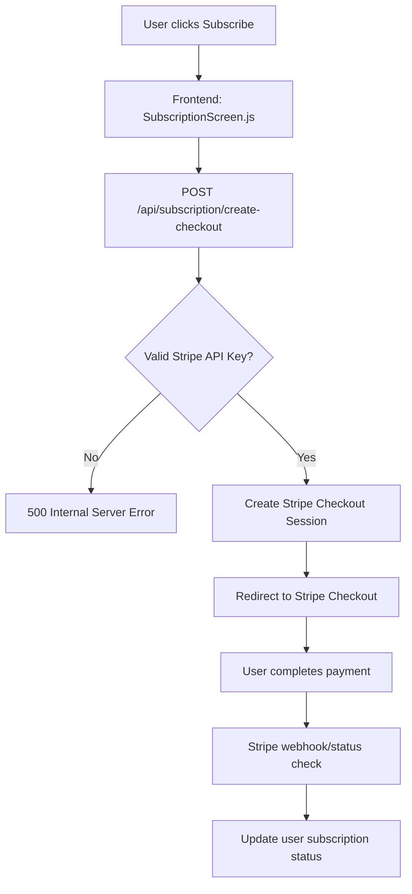

# Stripe Payment System - Technical Analysis & Implementation Guide

## 📋 Executive Summary

The Stripe subscription payment system in the AI Recipe + Grocery Delivery App is currently **BROKEN** due to invalid API key configuration. This document provides a comprehensive technical analysis, identifies root causes, and outlines the complete fix implementation.

## 🚨 Current Issue Status

### **CRITICAL ISSUE**: Stripe Integration Completely Non-Functional
- **Root Cause**: Invalid Stripe API key (`your-str************here` placeholder)
- **Impact**: Users cannot upgrade from free trial to paid subscription
- **Severity**: Revenue-blocking critical bug
- **Affected Users**: All users attempting to subscribe

## 🔍 Technical Analysis

### Backend Testing Results

```bash
# Endpoint Status Summary
✅ GET /api/subscription/status/{user_id}    - WORKING
❌ POST /api/subscription/create-checkout    - BROKEN (Stripe API key)
✅ POST /api/auth/login                      - WORKING
✅ Rate limiting                             - WORKING
```

### Current Payment Flow Architecture



### Current Code Issues

#### 1. **Invalid Stripe API Key** (CRITICAL)
```python
# Current broken configuration in server.py
STRIPE_API_KEY = os.environ.get('STRIPE_API_KEY')
# Environment variable contains: "your-str************here"
```

#### 2. **Subscription Logic Issue** (HIGH)
```python
# In create_subscription_checkout endpoint (line 3374)
if user.get('subscription_status') == 'active' and is_subscription_active(user):
    raise HTTPException(status_code=400, detail="User already has active subscription")
```
**Issue**: Redundant check - `is_subscription_active()` already checks if status is 'active'

#### 3. **Error Handling Issues** (MEDIUM)
- Returns 500 for user not found (should be 404)
- Returns 500 for invalid data (should be 400)
- Generic error messages don't help debugging

## 💡 Solution Architecture

### Phase 1: Environment Configuration
1. **Obtain Valid Stripe API Keys**
   - Test environment: `sk_test_...`
   - Production environment: `sk_live_...`
   - Publishable keys for frontend: `pk_test_...` / `pk_live_...`

2. **Update Environment Variables**
   ```bash
   # Backend .env
   STRIPE_API_KEY=sk_test_your_actual_stripe_secret_key_here
   STRIPE_PUBLISHABLE_KEY=pk_test_your_actual_stripe_publishable_key_here
   ```

### Phase 2: Backend Logic Fixes
1. **Simplify Subscription Check Logic**
2. **Improve Error Handling**
3. **Add Comprehensive Logging**
4. **Add Webhook Handler for Payment Events**

### Phase 3: Frontend Integration
1. **Add Stripe Elements for Card Collection** (if needed)
2. **Improve Error Handling in SubscriptionScreen.js**
3. **Add Loading States and User Feedback**

## 🛠 Implementation Files Structure

```
/app/docs/stripe/
├── STRIPE_PAYMENT_SYSTEM_ANALYSIS.md     # This file
├── STRIPE_IMPLEMENTATION_GUIDE.md        # Step-by-step implementation
├── STRIPE_TROUBLESHOOTING_GUIDE.md       # Common issues & solutions
└── STRIPE_TESTING_PROCEDURES.md          # Testing checklist

/app/backend/stripe/
├── stripe_service.py                     # Clean Stripe service layer
├── subscription_handlers.py              # Subscription logic
├── webhook_handlers.py                   # Stripe webhook processing
└── payment_models.py                     # Payment-related Pydantic models

/app/frontend/src/services/
├── stripeService.js                      # Frontend Stripe integration
└── subscriptionService.js                # Subscription API calls

/app/tests/stripe/
├── test_stripe_integration.py            # Backend Stripe tests
├── test_subscription_flow.py             # End-to-end subscription tests
└── test_webhook_handlers.py              # Webhook testing
```

## 📊 Current User Journey Analysis

### Demo User Current State
```json
{
  "user_id": "f99be98f-c1d5-4ccc-a3ad-9b62e01f4731",
  "email": "demo@test.com",
  "subscription_status": "trial",
  "trial_active": true,
  "subscription_active": false,
  "has_access": true,
  "trial_end_date": "2025-09-17",
  "days_remaining": 36
}
```

### Expected Payment Flow
1. **User on Trial** → Can create checkout session ✅
2. **User with Expired Trial** → Can create checkout session ✅
3. **User with Active Subscription** → Cannot create new checkout ✅
4. **Payment Success** → Update to `subscription_status: "active"` ❌ (needs webhook)

## 🔐 Security Considerations

### Current Security Implementation
- ✅ Server-side subscription package definition
- ✅ User validation before checkout creation
- ✅ Rate limiting on authentication endpoints
- ✅ Proper CORS configuration
- ❌ Missing webhook signature verification
- ❌ No Stripe API key validation on startup

### Required Security Enhancements
1. **Webhook Signature Verification**
2. **Stripe API Key Validation on Startup**
3. **Payment Amount Verification**
4. **Subscription Status Synchronization**

## 📈 Performance & Monitoring

### Current Monitoring
- ✅ Basic error logging
- ✅ Payment transaction records in database
- ❌ No Stripe event logging
- ❌ No payment failure tracking
- ❌ No subscription renewal monitoring

### Recommended Monitoring
1. **Payment Event Tracking**
2. **Subscription Renewal Alerts**
3. **Failed Payment Notifications**
4. **Churn Analysis Data Collection**

## 🎯 Success Criteria

### Functional Requirements
- [ ] Users can create checkout sessions during trial
- [ ] Users can create checkout sessions after trial expires
- [ ] Users with active subscriptions cannot create duplicate checkouts
- [ ] Payment success updates user subscription status
- [ ] Failed payments are handled gracefully
- [ ] Subscription renewals work automatically

### Technical Requirements
- [ ] Valid Stripe API keys configured
- [ ] Webhook endpoint properly handles Stripe events
- [ ] Proper error handling with appropriate HTTP status codes
- [ ] Comprehensive logging for debugging
- [ ] End-to-end testing coverage

## 🚀 Next Steps

1. **IMMEDIATE** (Revenue Critical)
   - Obtain valid Stripe API keys
   - Update environment configuration
   - Deploy API key fix

2. **SHORT TERM** (1-2 days)
   - Implement backend logic fixes
   - Add webhook handler
   - Improve error handling

3. **MEDIUM TERM** (1 week)
   - Add comprehensive testing
   - Implement monitoring
   - Frontend UX improvements

## 📞 Support Contacts

- **Stripe Documentation**: https://stripe.com/docs
- **Stripe Dashboard**: https://dashboard.stripe.com
- **Emergency Support**: Requires Stripe account setup

---

**Document Version**: 1.0  
**Last Updated**: January 2025  
**Author**: AI Development Team  
**Status**: Critical Issue Analysis Complete