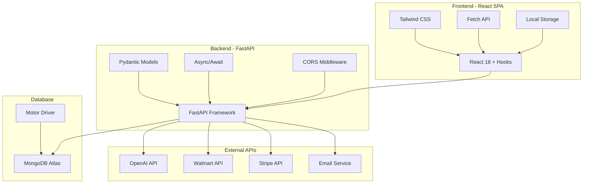
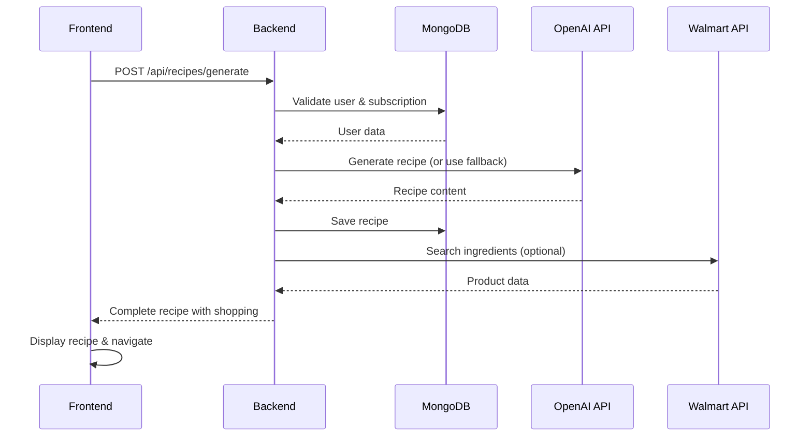
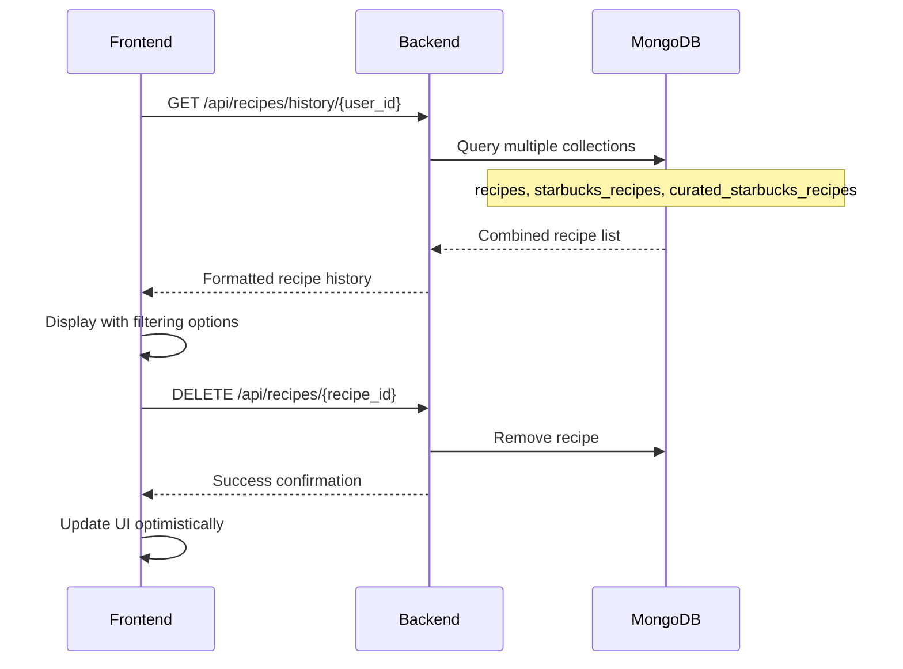
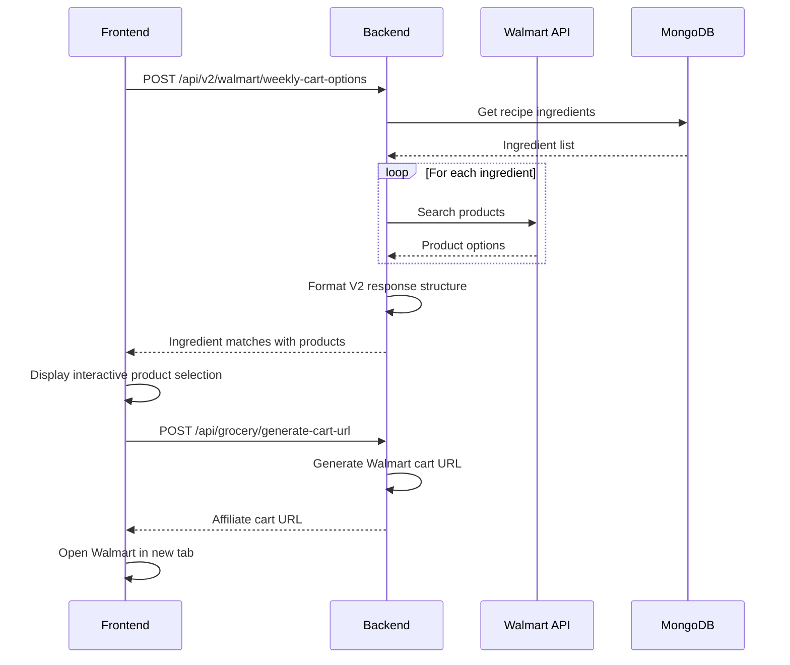

# AI Recipe + Grocery Delivery App - System Architecture

## Overview
This document provides a comprehensive technical architecture overview of the AI Recipe + Grocery Delivery App, designed for software engineers to understand the system structure, data flows, and integration patterns.

## High-Level Architecture

### Technology Stack


## Frontend Architecture

### Component Hierarchy
```
App.js (Root Component)
├── Authentication Layer
│   ├── LoginScreen
│   ├── RegisterScreen
│   └── WelcomeOnboarding
├── Main Application
│   ├── DashboardScreen
│   ├── RecipeGeneratorScreen
│   ├── RecipeHistoryScreen
│   ├── RecipeDetailScreen
│   ├── WeeklyRecipesScreen
│   └── StarbucksGeneratorScreen
├── Subscription Management
│   ├── SubscriptionScreen
│   ├── SubscriptionSuccess
│   └── SubscriptionGate
└── Utilities
    ├── TutorialScreen
    └── NotificationSystem
```

### State Management Pattern
```javascript
// Global state in App.js
const App = () => {
  // Authentication & User State
  const [user, setUser] = useState(null);
  const [isLoadingAuth, setIsLoadingAuth] = useState(true);
  
  // Navigation State
  const [currentScreen, setCurrentScreen] = useState('landing');
  const [currentRecipeId, setCurrentRecipeId] = useState(null);
  const [currentRecipeSource, setCurrentRecipeSource] = useState('weekly');
  
  // Application State
  const [notification, setNotification] = useState(null);
  const [weeklyRecipes, setWeeklyRecipes] = useState([]);
  
  // Stable callback functions using useCallback
  const showNotification = useCallback((message, type = 'success') => {
    setNotification({ message, type });
    setTimeout(() => setNotification(null), 4000);
  }, []);
  
  const handleViewRecipe = useCallback((recipeId, source = 'weekly') => {
    if (!recipeId) {
      showNotification('❌ Recipe ID is missing', 'error');
      return;
    }
    setCurrentRecipeId(recipeId);
    setCurrentRecipeSource(source);
    setCurrentScreen('recipe-detail');
  }, [showNotification]);
  
  // Component rendering logic
  const renderScreen = () => {
    switch (currentScreen) {
      case 'landing': return <LandingScreen onLogin={handleLogin} />;
      case 'dashboard': return <DashboardScreen user={user} />;
      case 'recipe-detail': 
        return <RecipeDetailScreen 
          key={`${currentRecipeId}-${currentRecipeSource}`}
          recipeId={currentRecipeId}
          recipeSource={currentRecipeSource}
          user={user}
          onBack={getBackNavigationHandler}
          showNotification={showNotification}
        />;
      // ... other cases
    }
  };
};
```

### API Communication Layer
```javascript
// Centralized API service
const API_BASE = process.env.REACT_APP_BACKEND_URL;

class APIService {
  static async call(endpoint, options = {}) {
    const url = `${API_BASE}/api${endpoint}`;
    const config = {
      headers: {
        'Content-Type': 'application/json',
        ...options.headers
      },
      ...options
    };
    
    try {
      const response = await fetch(url, config);
      
      if (!response.ok) {
        const errorText = await response.text();
        throw new Error(`HTTP ${response.status}: ${errorText}`);
      }
      
      return await response.json();
    } catch (error) {
      console.error(`API call failed: ${endpoint}`, error);
      throw error;
    }
  }
  
  // Service-specific methods
  static auth = {
    login: (credentials) => APIService.call('/auth/login', {
      method: 'POST',
      body: JSON.stringify(credentials)
    }),
    register: (userData) => APIService.call('/auth/register', {
      method: 'POST',
      body: JSON.stringify(userData)
    })
  };
  
  static recipes = {
    generate: (params) => APIService.call('/recipes/generate', {
      method: 'POST',
      body: JSON.stringify(params)
    }),
    getHistory: (userId) => APIService.call(`/recipes/history/${userId}`),
    getDetail: (recipeId) => APIService.call(`/recipes/${recipeId}/detail`),
    delete: (recipeId) => APIService.call(`/recipes/${recipeId}`, {
      method: 'DELETE'
    })
  };
}
```

## Backend Architecture

### FastAPI Application Structure
```python
# server.py - Main application
from fastapi import FastAPI, APIRouter, HTTPException, Depends, Request
from fastapi.middleware.cors import CORSMiddleware
from motor.motor_asyncio import AsyncIOMotorClient
from pydantic import BaseModel, validator
from typing import List, Optional, Dict, Any
import os
import logging
from datetime import datetime
import uuid

# Application setup
app = FastAPI(
    title="AI Recipe + Grocery Delivery API",
    version="2.0.0",
    description="Backend API for AI-powered recipe generation and grocery delivery"
)

# CORS configuration
app.add_middleware(
    CORSMiddleware,
    allow_origins=["http://localhost:3000"],  # Frontend URL
    allow_credentials=True,
    allow_methods=["GET", "POST", "PUT", "DELETE"],
    allow_headers=["*"],
)

# Database connection
MONGO_URL = os.environ.get('MONGO_URL')
client = AsyncIOMotorClient(MONGO_URL)
db = client.buildyoursmartcart

# Collections
users_collection = db.users
recipes_collection = db.recipes
weekly_recipes_collection = db.weekly_recipes
starbucks_recipes_collection = db.starbucks_recipes
curated_starbucks_recipes_collection = db.curated_starbucks_recipes

# API Router
api_router = APIRouter(prefix="/api")
```

### Request/Response Models
```python
# Pydantic models for type safety and validation
class UserRegistrationRequest(BaseModel):
    email: str
    password: str
    dietary_preferences: Optional[List[str]] = []
    allergies: Optional[List[str]] = []
    favorite_cuisines: Optional[List[str]] = []
    
    @validator('email')
    def email_must_be_valid(cls, v):
        if '@' not in v:
            raise ValueError('Invalid email address')
        return v
    
    @validator('password')
    def password_must_be_strong(cls, v):
        if len(v) < 6:
            raise ValueError('Password must be at least 6 characters')
        return v

class RecipeGenerationRequest(BaseModel):
    user_id: str
    cuisine_type: str
    difficulty: str
    servings: int
    dietary_preferences: Optional[List[str]] = []
    ingredients: Optional[List[str]] = []
    
    @validator('servings')
    def servings_must_be_positive(cls, v):
        if v <= 0:
            raise ValueError('Servings must be positive')
        return v

class RecipeResponse(BaseModel):
    id: str
    name: str
    description: str
    ingredients: List[str]
    instructions: List[str]
    prep_time: str
    cook_time: str
    servings: int
    difficulty: str
    cuisine_type: str
    created_at: str
    shopping_list: Optional[List[str]] = []

class WeeklyRecipeRequest(BaseModel):
    user_id: str
    family_size: int = 2
    dietary_preferences: Optional[List[str]] = []
    allergies: Optional[List[str]] = []
    favorite_cuisines: Optional[List[str]] = []
    exclude_ingredients: Optional[List[str]] = []
```

### Database Schema Design
```javascript
// MongoDB Collections Schema

// users collection
{
  "_id": ObjectId,
  "id": "uuid-string",
  "email": "user@example.com",
  "password_hash": "hashed_password",
  "is_verified": true,
  "verified_at": "2025-01-10T12:00:00Z",
  "subscription": {
    "status": "active|trialing|cancelled",
    "trial_starts_at": "2025-01-01T00:00:00Z",
    "trial_ends_at": "2025-01-08T00:00:00Z",
    "customer_id": "stripe_customer_id",
    "subscription_id": "stripe_subscription_id"
  },
  "preferences": {
    "dietary_preferences": ["vegetarian", "gluten-free"],
    "allergies": ["nuts", "dairy"],
    "favorite_cuisines": ["italian", "mexican"]
  },
  "created_at": "2025-01-01T00:00:00Z",
  "updated_at": "2025-01-01T00:00:00Z"
}

// recipes collection
{
  "_id": ObjectId,
  "id": "uuid-string",
  "user_id": "user-uuid",
  "name": "Recipe Name",
  "description": "Recipe description",
  "ingredients": ["ingredient1", "ingredient2"],
  "instructions": ["step1", "step2"],
  "prep_time": "30 minutes",
  "cook_time": "25 minutes",
  "servings": 4,
  "difficulty": "easy|medium|hard",
  "cuisine_type": "italian",
  "shopping_list": ["shopping item 1"],
  "created_at": "2025-01-01T00:00:00Z"
}

// weekly_recipes collection
{
  "_id": ObjectId,
  "id": "uuid-string", 
  "user_id": "user-uuid",
  "week_of": "2025-W02",
  "plan_name": "Weekly Meal Plan",
  "meals": {
    "monday": {
      "id": "meal-uuid",
      "name": "Italian Pasta Primavera",
      "day": "Monday",
      "cuisine": "italian",
      "prep_time": "20 minutes",
      "cook_time": "25 minutes",
      "servings": 2,
      "ingredients": ["ingredient1", "ingredient2"],
      "instructions": ["step1", "step2"],
      "cart_ingredients": [
        {
          "ingredient": "2 cups penne pasta",
          "products": [
            {
              "id": "walmart_product_id",
              "name": "Product Name",
              "price": "2.99",
              "image": "image_url"
            }
          ],
          "selected_product_id": "walmart_product_id"
        }
      ]
    }
    // ... other days
  },
  "total_budget": 85.50,
  "walmart_cart_url": "https://walmart.com/cart?items=...",
  "created_at": "2025-01-01T00:00:00Z"
}
```

## Data Flow Architecture

### Recipe Generation Flow


### Recipe History Flow


### Walmart Integration Flow


## Security Architecture

### Authentication & Authorization
```python
# JWT token handling
import jwt
from datetime import datetime, timedelta
from fastapi import HTTPException, Depends
from fastapi.security import HTTPBearer

security = HTTPBearer()

async def get_current_user(token: str = Depends(security)):
    try:
        payload = jwt.decode(token, SECRET_KEY, algorithms=["HS256"])
        user_id = payload.get("sub")
        
        if user_id is None:
            raise HTTPException(status_code=401, detail="Invalid token")
        
        user = await users_collection.find_one({"id": user_id})
        if user is None:
            raise HTTPException(status_code=401, detail="User not found")
        
        return user
    except jwt.PyJWTError:
        raise HTTPException(status_code=401, detail="Invalid token")

# Subscription access control
async def require_premium_access(user = Depends(get_current_user)):
    if not has_premium_access(user):
        raise HTTPException(status_code=402, detail="Premium subscription required")
    return user

def has_premium_access(user) -> bool:
    subscription = user.get("subscription", {})
    status = subscription.get("status")
    
    if status == "active":
        return True
    
    if status == "trialing":
        trial_end = subscription.get("trial_ends_at")
        if trial_end:
            return datetime.utcnow() < datetime.fromisoformat(trial_end.replace('Z', '+00:00'))
    
    return False
```

### Data Validation & Sanitization
```python
# Input validation using Pydantic
from pydantic import validator, Field
import re

class SecureRecipeRequest(BaseModel):
    user_id: str = Field(..., regex=r'^[a-f0-9]{8}-[a-f0-9]{4}-[a-f0-9]{4}-[a-f0-9]{4}-[a-f0-9]{12}$')
    cuisine_type: str = Field(..., max_length=50)
    ingredients: List[str] = Field(default=[], max_items=50)
    
    @validator('cuisine_type')
    def validate_cuisine(cls, v):
        allowed_cuisines = [
            'italian', 'mexican', 'chinese', 'indian', 'french', 
            'thai', 'japanese', 'mediterranean', 'american', 'korean'
        ]
        if v.lower() not in allowed_cuisines:
            raise ValueError('Invalid cuisine type')
        return v.lower()
    
    @validator('ingredients', each_item=True)
    def validate_ingredient(cls, v):
        if len(v) > 100:
            raise ValueError('Ingredient description too long')
        # Remove potentially harmful characters
        sanitized = re.sub(r'[<>"\']', '', v)
        return sanitized.strip()

# Database query protection
async def secure_find_user_recipes(user_id: str, page: int = 1, per_page: int = 20):
    # Validate inputs
    if not re.match(r'^[a-f0-9-]{36}$', user_id):
        raise ValueError('Invalid user ID format')
    
    if page < 1 or per_page < 1 or per_page > 100:
        raise ValueError('Invalid pagination parameters')
    
    # Safe database query
    skip = (page - 1) * per_page
    cursor = recipes_collection.find(
        {"user_id": user_id},  # Exact match, no injection possible
        {"password_hash": 0}   # Exclude sensitive fields
    ).skip(skip).limit(per_page)
    
    return await cursor.to_list(per_page)
```

## Performance Optimization

### Database Indexing Strategy
```javascript
// MongoDB indexes for performance
// Run these in MongoDB shell or startup script

// Users collection
db.users.createIndex({ "id": 1 }, { unique: true })
db.users.createIndex({ "email": 1 }, { unique: true })
db.users.createIndex({ "subscription.status": 1 })

// Recipes collection  
db.recipes.createIndex({ "id": 1 }, { unique: true })
db.recipes.createIndex({ "user_id": 1, "created_at": -1 })
db.recipes.createIndex({ "cuisine_type": 1 })
db.recipes.createIndex({ "user_id": 1, "cuisine_type": 1 })

// Weekly recipes collection
db.weekly_recipes.createIndex({ "id": 1 }, { unique: true })
db.weekly_recipes.createIndex({ "user_id": 1, "week_of": -1 })
db.weekly_recipes.createIndex({ "user_id": 1, "created_at": -1 })

// Starbucks recipes collections
db.starbucks_recipes.createIndex({ "id": 1 }, { unique: true })
db.starbucks_recipes.createIndex({ "user_id": 1, "created_at": -1 })
db.curated_starbucks_recipes.createIndex({ "id": 1 }, { unique: true })
```

### Caching Strategy
```python
# Simple in-memory caching for frequently accessed data
from functools import wraps
import asyncio
import time

class SimpleCache:
    def __init__(self):
        self.cache = {}
        self.expiry = {}
    
    def set(self, key: str, value: any, ttl: int = 300):
        self.cache[key] = value
        self.expiry[key] = time.time() + ttl
    
    def get(self, key: str):
        if key in self.cache and time.time() < self.expiry[key]:
            return self.cache[key]
        return None
    
    def invalidate(self, key: str):
        self.cache.pop(key, None)
        self.expiry.pop(key, None)

cache = SimpleCache()

def cached(ttl: int = 300):
    def decorator(func):
        @wraps(func)
        async def wrapper(*args, **kwargs):
            cache_key = f"{func.__name__}:{hash(str(args) + str(kwargs))}"
            
            cached_result = cache.get(cache_key)
            if cached_result is not None:
                return cached_result
            
            result = await func(*args, **kwargs)
            cache.set(cache_key, result, ttl)
            return result
        
        return wrapper
    return decorator

# Usage
@cached(ttl=600)  # Cache for 10 minutes
async def get_curated_starbucks_recipes():
    return await curated_starbucks_recipes_collection.find({}).to_list(100)
```

## Error Handling & Monitoring

### Structured Error Handling
```python
# Custom exception classes
class RecipeAppException(Exception):
    def __init__(self, message: str, error_code: str = None):
        self.message = message
        self.error_code = error_code
        super().__init__(self.message)

class UserNotFoundError(RecipeAppException):
    def __init__(self, user_id: str):
        super().__init__(f"User not found: {user_id}", "USER_NOT_FOUND")

class RecipeGenerationError(RecipeAppException):
    def __init__(self, details: str):
        super().__init__(f"Recipe generation failed: {details}", "RECIPE_GENERATION_FAILED")

# Global exception handler
from fastapi import Request
from fastapi.responses import JSONResponse

@app.exception_handler(RecipeAppException)
async def recipe_app_exception_handler(request: Request, exc: RecipeAppException):
    return JSONResponse(
        status_code=400,
        content={
            "error": exc.error_code or "APPLICATION_ERROR",
            "message": exc.message,
            "timestamp": datetime.utcnow().isoformat()
        }
    )

# Structured logging
import logging
import json

class StructuredFormatter(logging.Formatter):
    def format(self, record):
        log_entry = {
            "timestamp": self.formatTime(record),
            "level": record.levelname,
            "logger": record.name,
            "message": record.getMessage(),
            "module": record.module,
            "function": record.funcName,
            "line": record.lineno
        }
        
        if hasattr(record, 'user_id'):
            log_entry['user_id'] = record.user_id
            
        if hasattr(record, 'request_id'):
            log_entry['request_id'] = record.request_id
            
        return json.dumps(log_entry)

# Configure logging
logging.basicConfig(level=logging.INFO)
handler = logging.StreamHandler()
handler.setFormatter(StructuredFormatter())
logger = logging.getLogger(__name__)
logger.addHandler(handler)
```

## Deployment Architecture

### Environment Configuration
```python
# Environment-specific configuration
from pydantic import BaseSettings
from typing import Optional

class Settings(BaseSettings):
    # Database
    mongo_url: str
    
    # External APIs
    openai_api_key: Optional[str] = "your-openai-api-key-here"
    walmart_consumer_id: Optional[str] = None
    walmart_private_key: Optional[str] = None
    stripe_secret_key: Optional[str] = None
    
    # Email Service
    mailjet_api_key: Optional[str] = None
    mailjet_secret_key: Optional[str] = None
    sender_email: Optional[str] = None
    
    # Application
    secret_key: str = "your-secret-key"
    debug: bool = False
    
    class Config:
        env_file = ".env"

settings = Settings()

# Feature flags based on environment
FEATURES = {
    "openai_integration": settings.openai_api_key != "your-openai-api-key-here",
    "walmart_integration": bool(settings.walmart_consumer_id and settings.walmart_private_key),
    "stripe_integration": bool(settings.stripe_secret_key),
    "email_integration": bool(settings.mailjet_api_key and settings.mailjet_secret_key)
}
```

This comprehensive architecture documentation provides software engineers with a complete technical understanding of the system structure, data flows, and implementation patterns for effective maintenance and enhancement of the AI Recipe + Grocery Delivery App.